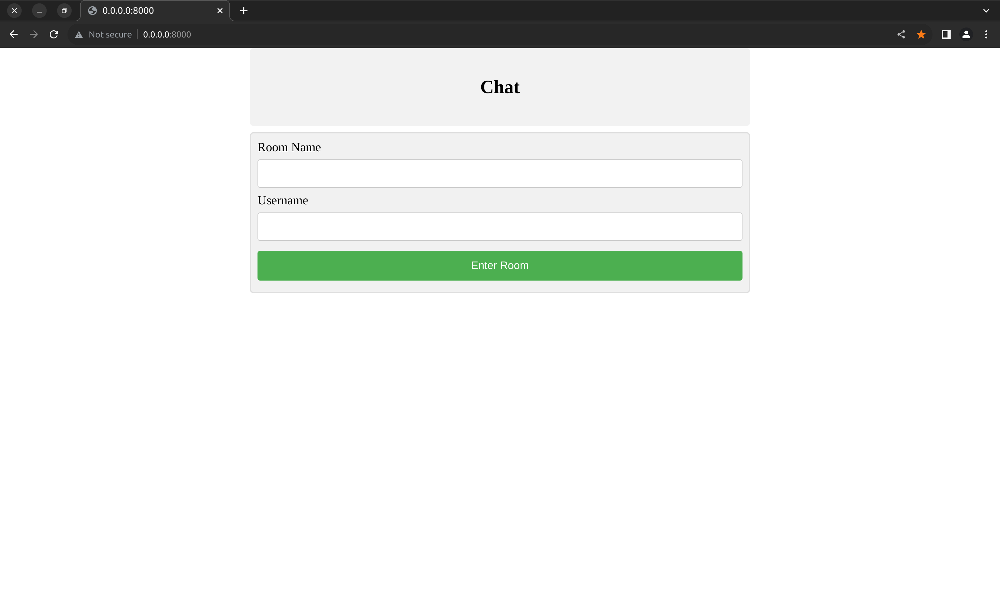

# Blog

## 📦 Tech Stack:

- [Django](https://www.djangoproject.com/)  - Django makes it easier to build better web apps more quickly and with less code.
- [jQuery](https://jquery.com/): The Write Less, Do More, JavaScript Library.

## Demo:




## Getting Started: 

- Clone repository 

```bash
mkdir ~/Dev/chat -p
cd ~/Dev/chat
git clone https://github.com/Arvind-4/Chat-App-Using-Django.git .
```  

- Install Dependencies:

```bash
cd ~/Dev/chat
python3.8 -m pip install virtualenv
python3.8 -m virtualenv . 
source bin/activate
pip install -r requirements.txt
```

- Run Server:

```bash
cd ~/Dev/chat
python manage.py runserver
```

Open [localhost:8000](http://localhost:8000) in your favourite browser :)
